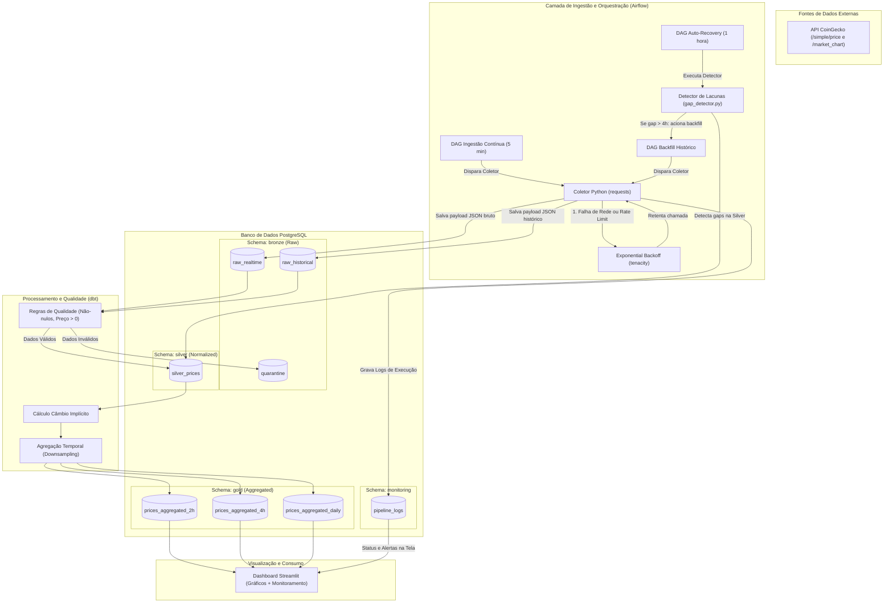

# 🪙 BTC Data Pipeline – Monitoramento Inteligente de Preços de Bitcoin

Este repositório contém a implementação da **2ª Avaliação (Parte 2)** da disciplina de **Engenharia de Dados** do Centro Universitário de Brasília (CEUB).

O projeto implementa um ciclo de vida completo de engenharia de dados (ELT) em container para monitoramento resiliente de preços de Bitcoin, calculando taxas de câmbio implícitas e estruturando dados em camadas lógicas (Bronze, Silver, Gold).

## 👥 Alunos
- **João Bizzo** - Matrícula: **22252028**
- **Pietra Paz** - Matrícula: **22401571**

---

## 🏗️ Arquitetura "As-Built" (Efetivamente Implementada)

A arquitetura de dados segue o padrão **Medalhão** (Bronze, Silver e Gold), integrada com fluxos de qualidade, monitoramento operacional de tarefas e um loop de retroalimentação automático para recuperação de dados (*backfill*).



---

## 📝 Relatório de Mudanças e Justificativas Técnicas

Em comparação ao planejamento inicial feito na Prova 1, as seguintes alterações arquiteturais foram implementadas:

1.  **Refatoração de Domínios de Negócio:**
    *   *Antes:* Os domínios eram mapeados diretamente como etapas técnicas (Ingestão, Analytics, Consumo).
    *   *Depois:* Os domínios foram redefinidos com foco em áreas de conhecimento de negócio: **Inteligência de Mercado Cripto**, **Conversão Cambial**, **Analytics Temporal** e **Portfólio/Consumo**.
2.  **Camada de Quarentena e Proteção de Qualidade:**
    *   Introdução de regras lógicas de qualidade em Python antes do banco de dados (ex: verificação de nulos, tipos numéricos e preços negativos). Linhas corrompidas ou inválidas não entram na camada Silver; são enviadas para `bronze.quarantine` para auditoria.
3.  **Tabela de Logs e Visão de Monitoramento:**
    *   Criação do esquema `monitoring` com a tabela `pipeline_logs`. Todas as execuções de coleta (tempo real ou histórica) registram metadados de execução. O dashboard Streamlit consome essa tabela, apresentando um portal executivo da saúde da pipeline.
4.  **Loop de Retroalimentação (Gap Detector):**
    *   Desenvolvimento do script `gap_detector.py` agendado no Airflow. Ele varre a série temporal da camada Silver em busca de janelas sem dados maiores que 4 horas. Ao encontrar um gap, dispara automaticamente a DAG de Backfill Histórico dos dias específicos, garantindo autocura do pipeline.
5.  **Utilização do Streamlit em vez do Metabase:**
    *   O Streamlit foi escolhido pois permite escrever o dashboard analítico inteiramente em Python, integrando-o nativamente no controle de versão Git do repositório, sem depender de backups externos de bases de dados do Metabase.

---

## 📁 Estrutura de Pastas do Repositório

```
btc-data-pipeline/
├── dags/                    # DAGs de orquestração do Apache Airflow
│   ├── btc_ingestion_and_transform.py # Ingestão recorrente + dbt run/test
│   ├── btc_backfill.py      # Ingestão histórica sob demanda + dbt
│   └── btc_auto_recovery.py # Monitor de gaps e autocura (feedback loop)
├── dbt_project/             # Diretório de modelos e configurações do dbt
│   ├── macros/
│   │   └── generate_schema_name.sql # Macro dbt para escrita direta em schemas
│   ├── models/
│   │   ├── gold/            # Modelos agregados por tempo (2h, 4h, daily) e schema.yml
│   │   └── silver/          # Modelo estruturado/câmbio implícito e schema.yml
│   ├── dbt_project.yml      # Configuração global do projeto dbt
│   └── profiles.yml         # Configuração de conexão do dbt ao banco
├── docs/                    # Relatórios e documentações teóricas de arquitetura
├── src/                     # Código Python principal da aplicação
│   ├── app/
│   │   └── dashboard.py     # Frontend Streamlit (Dashboard Analítico + Monitoramento)
│   ├── config.py            # Carregamento de variáveis de ambiente (.env)
│   ├── database.py          # Conexão com Postgres e Inicialização de Schemas
│   ├── ingestion/
│   │   ├── client.py        # Cliente HTTP CoinGecko (resiliência e retries)
│   │   ├── gap_detector.py  # Detector automático de gaps na série temporal
│   │   └── pipeline.py      # Execução de fluxo Realtime (Bronze) e Historical
│   └── quality/
│       └── rules.py         # Regras de qualidade aplicadas pré-banco
├── docker-compose.yml       # Orquestrador local multi-container do projeto
├── Dockerfile.airflow       # Customização da imagem padrão do Airflow com dbt
├── Dockerfile.streamlit     # Customização da imagem da aplicação Streamlit
├── requirements.txt         # Pacotes Python requeridos
└── .env.example             # Exemplo de arquivo de variáveis de ambiente
```

---

## 🚀 Guia de Execução e Testes do Protótipo

Siga os passos abaixo para buildar e rodar o projeto localmente em seu terminal:

### Passo 1: Configurar Variáveis de Ambiente
Copie o arquivo `.env.example` para `.env` na raiz do projeto:
```bash
cp .env.example .env
```
*(Opcional: Caso possua uma chave Demo da CoinGecko, insira-a no campo `COINGECKO_API_KEY` do arquivo `.env` para evitar rate-limits).*

### Passo 2: Construir e Iniciar os Containers Docker
Execute o comando abaixo para realizar o build das imagens personalizadas do Airflow e do Streamlit, e subir os serviços em segundo plano:
```bash
docker compose up -d --build
```
*(Nota: Esse comando subirá 5 containers: `btc_postgres`, `btc_airflow_init`, `btc_airflow_webserver`, `btc_airflow_scheduler` e `btc_streamlit`).*

### Passo 3: Executar a Carga Inicial de Dados (Bootstrap / Backfill)
Por padrão, o banco de dados estará com as tabelas criadas, mas sem dados acumulados. Você possui duas formas de realizar a carga inicial de dados históricos:
*   **Opção A (Via Streamlit):** Acesse o dashboard em [http://localhost:8501](http://localhost:8501). O sistema detectará o banco vazio e oferecerá um botão em tela para rodar uma ingestão histórica inicial.
*   **Opção B (Via Airflow):** Acesse a interface do Airflow em [http://localhost:8080](http://localhost:8080).
    *   **Usuário:** `admin` | **Senha:** `admin`
    *   Localize a DAG `btc_historical_backfill`, ative-a e dispare a execução clicando no botão **Trigger DAG**. Por padrão, ela coletará os últimos 30 dias de dados do Bitcoin em USD e BRL, rodando o dbt logo em seguida.

### Passo 4: Visualizar os Resultados no Dashboard Streamlit
Acesse [http://localhost:8501](http://localhost:8501) no seu navegador para interagir com o protótipo:
*   **📈 Painel de Cotações:** Gráficos interativos Plotly das cotações em tempo real/histórico e câmbio implícito.
*   **📊 Granularidades (Gold):** Visualização de dados agregados em 2h, 4h e Diário, contendo faixas sombreadas de volatilidade histórica.
*   **🛡️ Monitoramento e Qualidade:** Indicadores chave de execuções do pipeline, log detalhado das tarefas e auditoria de linhas rejeitadas que foram desviadas para a Quarentena.

---

## 🛡️ Validação da Resiliência e Caminho Não-Feliz

Para validar o funcionamento dos mecanismos de qualidade e retroalimentação na sua apresentação, você pode:

1.  **Simular Erros de Qualidade de Dados:**
    Insira uma linha manualmente na tabela crua contendo dados inválidos (ex: preço negativo) e verifique se o pipeline de qualidade desvia o registro para a tabela `bronze.quarantine` e gera uma falha visual no dashboard de monitoramento.
2.  **Simular Perda de Dados (Lacunas):**
    Delete propositalmente registros da tabela `silver.silver_prices` equivalentes a um período de 12 horas. Aguarde a execução horária da DAG `btc_auto_recovery` ou execute-a manualmente no Airflow. Ela detectará a lacuna na série temporal e disparará a DAG de Backfill para preencher automaticamente o buraco na base de dados (autocura).