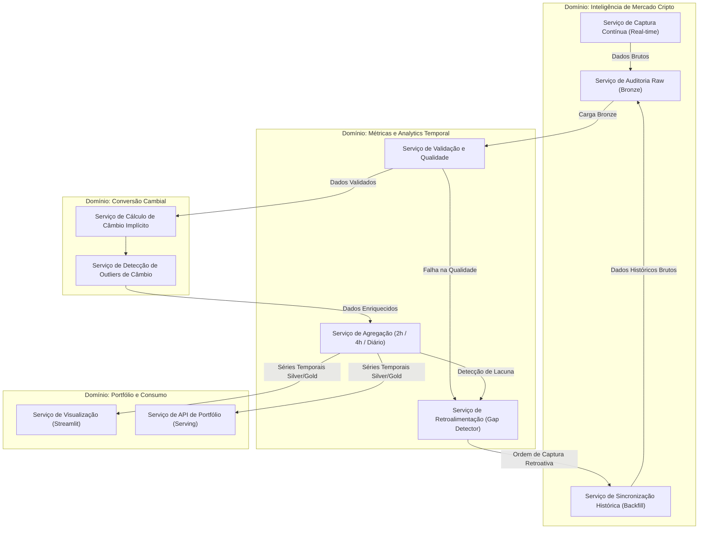

# 🏢 Domínios e Serviços de Negócio

Para corrigir o acoplamento conceitual entre etapas técnicas do pipeline e domínios de negócio, redefinimos os limites organizacionais do projeto com base em **Domínios de Negócio e Conhecimento**. Cada domínio possui responsabilidades funcionais bem delineadas.

---

## 1. Domínio de Inteligência de Mercado Cripto (*Crypto Market Intelligence*)
Responsável pelo entendimento, coleta e validação inicial das informações do mercado de criptoativos globais. É a fronteira de contato com os provedores externos de dados (CoinGecko).

*   **Serviço de Captura Contínua (Real-time):** Executa a sondagem periódica de preços do Bitcoin (BTC/USD e BTC/BRL) em alta frequência para o acompanhamento tático do mercado.
*   **Serviço de Sincronização Histórica (Backfill):** Responsável por obter séries históricas longas para popular o banco de dados inicialmente ou para reconstruir o histórico após períodos de indisponibilidade de rede.
*   **Serviço de Auditoria Raw (Bronze):** Garante a imutabilidade dos dados conforme coletados, servindo de trilha de auditoria para o negócio.

---

## 2. Domínio de Conversão Cambial e Macroeconomia (*Exchange Rates & Forex*)
Responsável pelas regras de tradução de valores entre moedas estrangeiras (USD) e nacionais (BRL). Em vez de introduzir dependências de APIs de terceiros para cotação de moedas (o que aumentaria os custos e os pontos de falha), este domínio calcula taxas de câmbio implícitas baseadas na paridade de preços do Bitcoin.

*   **Serviço de Cálculo de Câmbio Implícito:** Consolida as cotações de BTC nas duas moedas e gera a taxa de câmbio teórica instantânea ($USD\_BRL = BTC\_BRL / BTC\_USD$).
*   **Serviço de Detecção de Divergências:** Monitora a consistência do câmbio implícito contra limites macroeconômicos razoáveis (outliers de câmbio).

---

## 3. Domínio de Métricas e Analytics Temporal (*Temporal Analytics & Quality*)
Responsável pelo ciclo de vida da qualidade, limpeza e estruturação temporal dos dados. É o domínio que define como os dados serão consumidos de forma eficiente, aplicando regras de agregação para otimizar custos de armazenamento.

*   **Serviço de Validação e Qualidade (Data Quality):** Avalia se os dados atendem a critérios de integridade (ex: preço positivo, ausência de nulos). Direciona dados com falha para a Quarentena.
*   **Serviço de Agregação de Janelas Temporais:** Transforma dados de granularidade fina em janelas de 2 horas (última semana), 4 horas (último mês) e diária (histórico consolidado), aplicando regras de downsampling.
*   **Serviço de Retroalimentação de Lacunas (Gap Detector):** Analisa a série temporal na camada Silver e, ao detectar lacunas de tempo, envia uma ordem de requisição ao *Serviço de Sincronização Histórica* para recuperar os dados perdidos (feedback loop).

---

## 4. Domínio de Portfólio e Consumo do Investidor (*Investor Portfolio & Serving*)
Responsável por expor informações prontas para o consumo de stakeholders internos e externos, oferecendo visões analíticas de mercado.

*   **Serviço de Visualização Analítica (Dashboard):** Expõe gráficos de volatilidade, câmbio implícito e o status do pipeline em tempo real de forma intuitiva.
*   **Serviço de API de Portfólio (Serving):** Disponibiliza endpoints estruturados para o consumo por sistemas externos de carteiras ou bots de trading.

---

## 🗺️ Diagrama de Domínios e Serviços de Negócio

