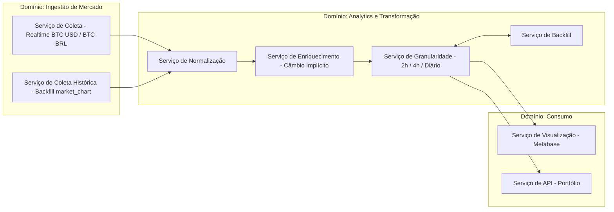

---

## Domínios e Serviços

### Ingestão de Mercado (Market Intelligence)

Responsável pela coleta de dados externos diretamente da API da CoinGecko.

* **Serviço de Coleta (Realtime)**
  Responsável por coletar preços atuais do Bitcoin (BTC/USD e BTC/BRL) em intervalos regulares utilizando o endpoint `/simple/price`.

* **Serviço de Coleta Histórica (Batch / Backfill)**
  Responsável por recuperar séries temporais históricas utilizando o endpoint `/market_chart`, permitindo reconstrução de dados e preenchimento de lacunas.

---

### Analytics e Transformação

Responsável por processar, padronizar e enriquecer os dados.

* **Serviço de Normalização**
  Converte os dados brutos da camada Bronze em um formato estruturado (timestamps, campos padronizados, etc.).

* **Serviço de Enriquecimento (Câmbio Implícito)**
  Calcula a taxa USD/BRL com base nos preços BTC/USD e BTC/BRL durante a transformação para a camada Silver.

* **Serviço de Granularidade**
  Aplica regras de agregação conforme o tempo:

  * 2h (última semana)
  * 4h (último mês)
  * diário (histórico)

* **Serviço de Backfill**
  Detecta lacunas no histórico e aciona coletas retroativas via endpoint histórico.

---

### Consumo

Responsável por disponibilizar os dados processados.

* **Serviço de Visualização**
  Integração com ferramentas como Metabase para análise e dashboards.

* **Serviço de API / Portfólio**
  Disponibiliza os dados para o seu backend (sistema de carteira de Bitcoin).

---

# Diagrama atualizado (Mermaid)

