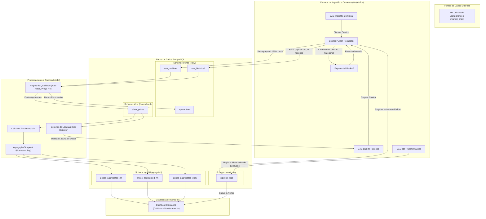

# Arquitetura e Fluxo de Dados "As-Built"

A arquitetura do **BTC Data Pipeline** baseia-se no padrão **Medalhão** (Bronze, Silver e Gold), estendida para suportar fluxos de resiliência, qualidade de dados, monitoramento e retroalimentação automática (caminho não-feliz).

---

## 1. Fluxo de Dados de Ponta a Ponta

### A. Camada de Ingestão e Qualidade (Bronze & Quarentena)
*   **Ingestão:** Os coletores Python executam requisições periódicas à API CoinGecko.
*   **Qualidade:** Antes de persistir os dados na camada estruturada, um componente de validação avalia as regras de integridade (preço positivo, ausência de nulos e formato correto).
*   **Quarentena:** Registros inválidos ou corrompidos são direcionados para a tabela `bronze.quarantine` com a descrição do erro de validação. Isso impede a poluição das camadas analíticas e permite auditoria posterior (governança).

### B. Camada de Integração e Enriquecimento (Silver)
*   Os dados válidos são limpos, os timestamps Unix são convertidos para o padrão UTC (ISO-8601) e inseridos na tabela `silver.silver_prices`.
*   Nessa camada é calculado o câmbio implícito USD/BRL e inserido de forma estruturada.

### C. Camada Analítica e Agregações (Gold)
*   Executada via dbt, essa camada lê de `silver.silver_prices` e constrói views ou tabelas incrementais agrupadas por granularidade (2h, 4h e Diária) para consumo, resolvendo o problema de otimização de custo e performance de séries históricas longas.

### D. Camada de Consumo (Serving)
*   **Dashboard Streamlit:** Consome diretamente da camada Gold e Silver do PostgreSQL para apresentar análises de preços e câmbio aos investidores.
*   **Monitoramento:** O Streamlit lê os metadados de execução da camada de monitoramento para expor a integridade da pipeline.

---

## Mecanismos de Retroalimentação (Caminho não-feliz)

1.  **Exponential Backoff na Ingestão:** Se a API da CoinGecko retornar erro `429 (Too Many Requests)` ou falha de conexão, o coletor aplica tentativas de reenvio exponenciais antes de desistir.
2.  **Detecção de Lacunas (Gap Detector):** Periodicamente, o dbt ou uma tarefa específica do Airflow executa uma verificação na tabela `silver.silver_prices` buscando saltos incomuns de tempo na série temporal.
3.  **Backfill Automático (Retroalimentação):** Caso lacunas sejam detectadas (ex: devido a queda prolongada de internet local ou indisponibilidade da API), a pipeline de Backfill Histórico é disparada programaticamente para buscar os dados faltantes do período exato no endpoint `/market_chart`.

---

## Monitoramento e Governança

*   **Tabela de Logs (`monitoring.pipeline_logs`):** Registra cada execução das tarefas (início, fim, status - SUCESSO/FALHA, quantidade de linhas inseridas, quantidade de falhas de qualidade e logs de erro).
*   **Governança de Dados:** Definição de propriedade de dados e dicionário estruturado. A linhagem do dado é controlada e versionada pelo dbt, garantindo que toda transformação de código seja auditável.

---

## Diagrama de Arquitetura Detalhado

